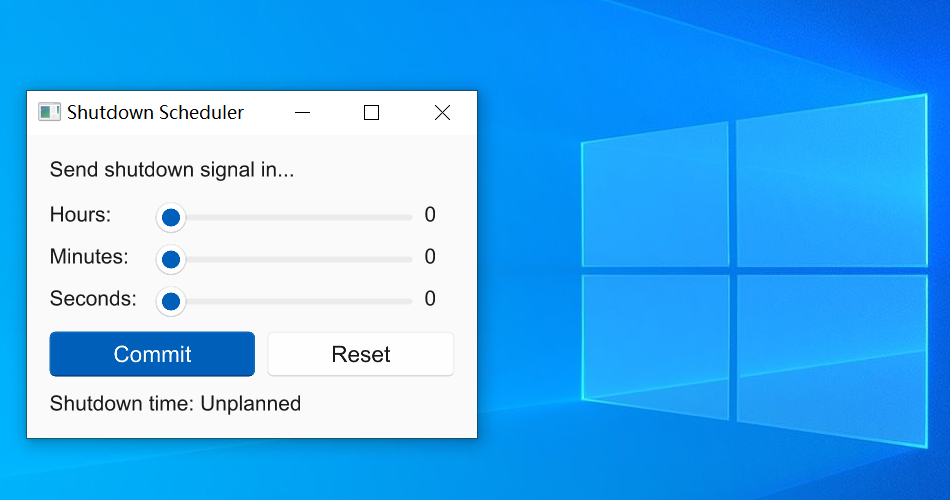

# Shutdown-scheduler

Shutdown-scheduler is an easy-to-use tool that helps you shutdown your computer in a specific time. It supports Windows, Linux & MacOS.  

## Notice

- This software is based in part on the work of the Slint project (https://slint.dev/).
- The code in this project is under MIT license, but the final product is under **GPLv3** license.
